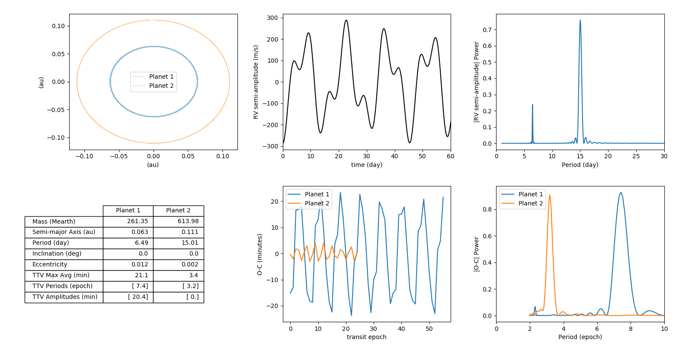
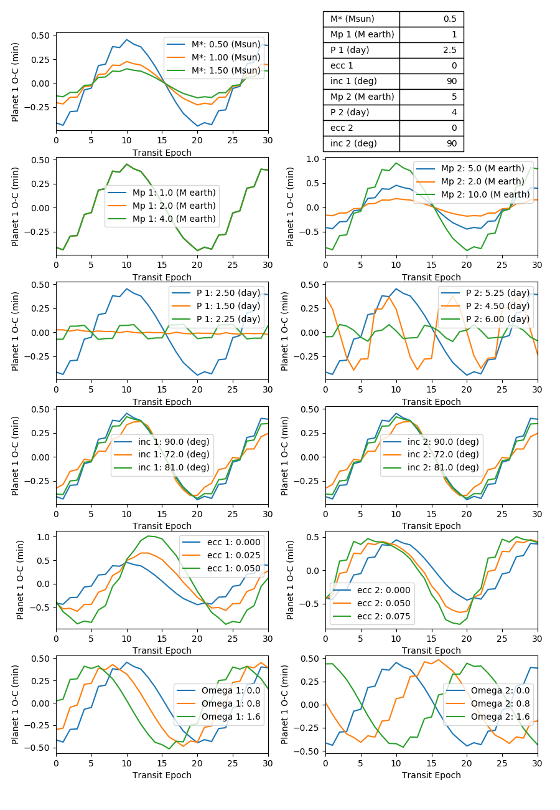
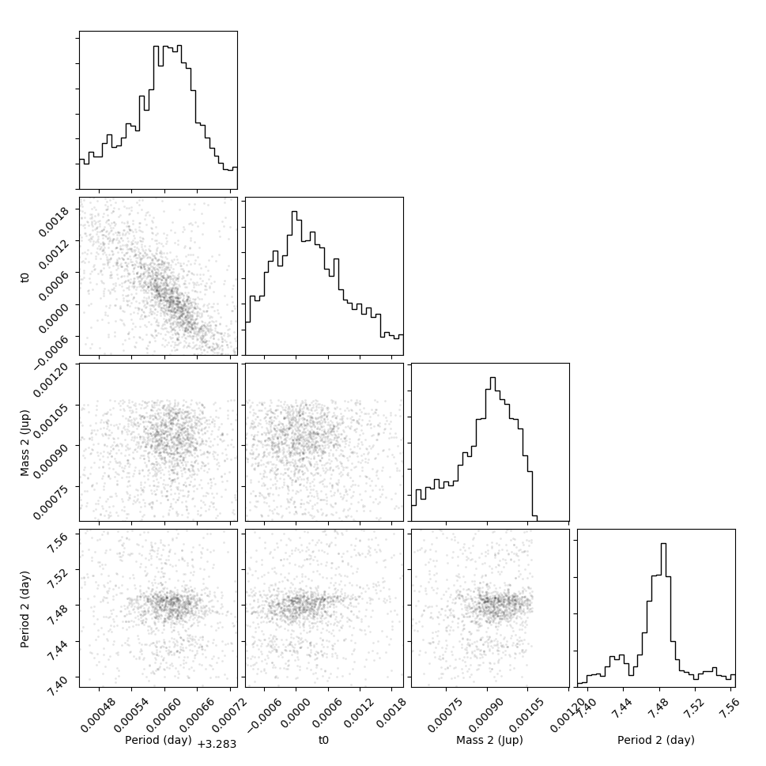

# N-Body TTV Retrieval
A python 3 package for generating N-body simulations, computing transit timing variations (TTV) and retrieving orbit parameters and uncertainties from TTV measurements within a Bayesian framework.

## Background
Transiting exoplanets in multiplanet systems exhibit non-Keplerian orbits as a result of the graviational influence from companions which can cause the times and durations of transits to vary (TTV/TDV). The amplitude and periodicity of the transit time variations are characteristic of the perturbing planet's mass and orbit. 

## Generate an N-body simulation 
The n-body simulations in this research make use of the [REBOUND](https://rebound.readthedocs.io) code. To generate a random simulation follow the code below: 
```python
from nbody.simulation import generate, integrate, analyze, report
from nbody.tools import mjup,msun,mearth

if __name__ == "__main__":
    
    # units: Msun, Days, au
    objects = [
        {'m':1.12},
        {'m':0.28*mjup/msun, 'P':3.2888, 'inc':3.14159/2,'e':0, 'omega':0  }, 
        {'m':1*mjup/msun, 'P':7.5, 'inc':3.14159/2,'e':0,  'omega':0  }, 
    ]

    # create REBOUND simulation
    sim = generate(objects)

    # year long integrations, timestep = 1 hour
    sim_data = integrate(sim, objects, 365, 365*24) 
    
    # collect the metrics of interest from the simulation
    ttv_data = analyze(sim_data)

    # plot the results 
    report(ttv_data, savefile='report.png')
```
An example simulation report looks like this: 

**Top Left** plots of the orbit positions for each object. **Top Middle** Radial velocity semi-amplitude (m/s) for the star. **Top Right** Periodogram of RV semi-amplitude signal. **Bottom Left** Table of simulation parameters. **Bottom Middle** The difference between the observed transit time and calculated linear ephemeris (O-C). **Bottom Right** Periodogram of O-C signal for each planet. 

The data product for each simulation returned by `analyze(...)` will look like: 
```python
ttv_data = {
    'mstar': float,     # mass of star (msun)
    'objects': dict,    # dictionary passed to generate_simulation(...) method 
    'times': ndarray,   # array of each time in simulation 

    'RV':{
        'signal': ndarray, # RV semi-amplitude signal as a function of time (m/s)
        'max': float        # average between maximum and 75% percentile of RV semi-amplitude (m/s)

        'freq': ndarray,    # frequencys in periodogram (1./day)
        'power': ndarray,   # periodogram power from Lomb Scargle routine
    },

    'planets':[  # list of planet parameter dictionaries 
        {
            # orbit parameters
            'm': float,    # mass of planet in msun
            'a': float,    # average semi-major axis of simulation orbits (au)
            'e': float,    # average eccentricity of simulation orbits
            'inc': float,  # average inclination from simulation orbits
            'x': ndarray,  # downsampled orbit positions (1/10 resolution, au)
            'y': ndarray,  # downsampled orbit positions (1/10 resolution, au)

            # transit time data 
            'P': float,      # period derived from linear fit to mid transit times (day)
            't0': float,     # 0th epoch transit time from linear fit to mid transit times (day)
            'tt': ndarray,   # mid-transit times (day)
            'ttv': ndarray,  # o-c values (linear ephemeris subtracted from tt) (day)
            'max': float     # average between maximum and 75% percentile of O-C signal (min)

            # periodogram data of o-c signal 
            'freq': ndarray,    # frequencys in periodogram (1./epoch)
            'power': ndarray,   # periodogram power from Lomb Scargle routine
        }
    ]
}
```

## Estimating Planet Orbits
The presence of additional planets or even moons in an exoplanet system can be inferred by measuring perturbations in the orbit of a transiting exoplanet. The gravitational influence from the campanion, even if it is non-transiting, can perturb the transiting planet in a manner characteristic to the orbit of the perturbing planet. The plot below shows how each parameter in a planetary system can impact our measured transit signal.


We use our N-body code to explore the parameter space governing our transit timing calculations to better assess which parameters have the most influence on the shape of the signal. After each simulation, a least-squares linear fit is calculated from the mid transit values in order to derive the ephemeris (now referred to as calculated). The linear ephemeris is then subtracted from the "observed" mid transit values and the residuals are plotted (O-C) indicating perturbations from a periodic orbit. The default transit parameters, shown in the table, are varied one by one within each subplot. 

In order to derive the orbit parameters from observations gradient-based techniques have been proposed to expedite the orbit optimization using N-body simulations however they inherently find local minima in a degenerate phase space (e.g. mass and eccentricity) unless priors are heavily constrained. We introduce a new method for retrieving orbit parameters within a Bayesian framework using nested sampling. Nested Sampling allows us to sample multimodal distributions and infer uncertainities from our posteriors in a manner more efficient than a Markov Chain Monte Carlo. 

```python
import matplotlib.pyplot as plt
import numpy as np
import corner 

from nbody.simulation import generate, integrate, analyze, report, nested_nbody
from nbody.tools import mjup,msun,mearth,G,au,rearth,sa

if __name__ == "__main__":
    
    # units: Msun, Days, au
    objects = [
        {'m':1.12},
        {'m':0.28*mjup/msun, 'P':3.2888, 'inc':3.14159/2,'e':0, 'omega':0  }, 
        {'m':1*mjup/msun, 'P':7.5, 'inc':3.14159/2,'e':0,  'omega':np.pi/4  }, 
    ]

    # create REBOUND simulation
    sim = generate(objects)

    # year long integrations, timestep = 1 hour
    sim_data = integrate(sim, objects, 60, 60*24) 
    
    # collect the analytics of interest from the simulation
    ttv_data = analyze(sim_data)

    # simulate some observational data with noise 
    ttv = ttv_data['planets'][0]['ttv']
    ttv += np.random.normal(0.25,0.25,len(ttv))/(24*60)
    epochs = np.arange(len(ttv))
    err = np.random.normal(30,5,len(ttv))/(24*60*60)
    del objects[-1]

    # estimate priors
    bounds = [5*mearth/msun, 2*mjup/msun, 6,9, 0.0,0.1]

    # TODO newobj create, create plotting routine for final solution and posters
    newobj, posteriors = nested_nbody( epochs,ttv,err, objects, bounds )

    f = corner.corner(posteriors, labels=['mass','per','ecc'],bins=int(np.sqrt(posteriors.shape[0])), plot_contours=False, plot_density=False)
    plt.show() 

```
Posteriors from the TTV retrieval will look something like this: 



## File Guide 
- `testnest.py` - a program to test bayesian inference using MultiNest
- Lomb Scargle Periodogram test
- Accuracy vs timeDelta 
- `nbody_parameter_explore.py` - see how various parameters impact results from the N-body simulations
- `generate_simulations.py` - easily generate multiple simulations for machine learning projects

## Citation 
If you use any of these algorithms in your work please include Kyle A. Pearson as a coauthor. Current institution: Lunar and Planetary Laboratory, University of Arizona, 1629 East University Boulevard, Tucson, AZ, 85721, USA

## Future updates
- implement RV fitting to reduce degeneracies
- include multiple O-C signals for transiting multiplanet systems
- use NN or clustering technique to estimate priors from simulation archive