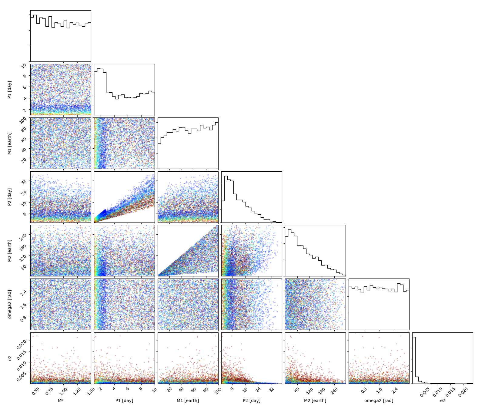
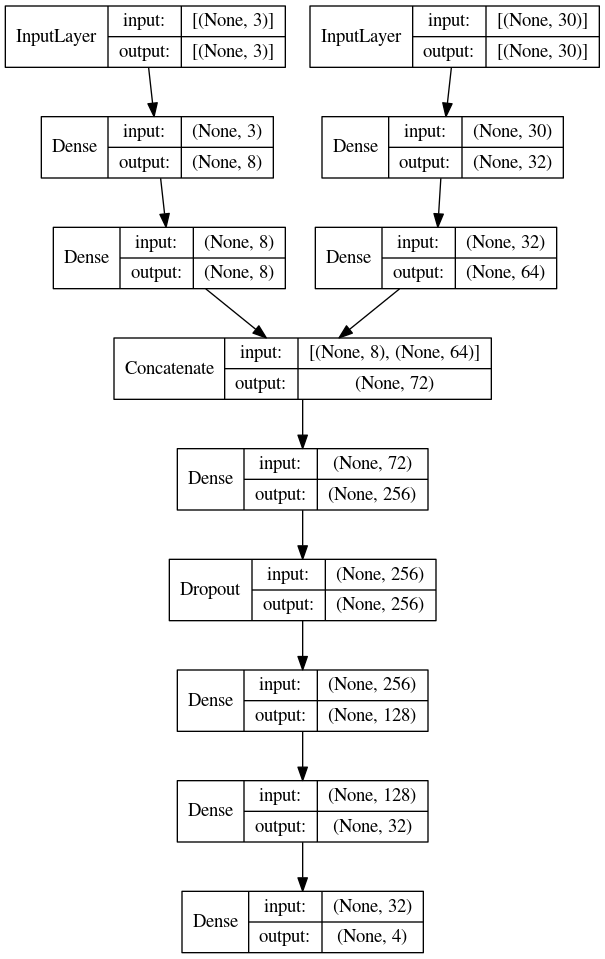
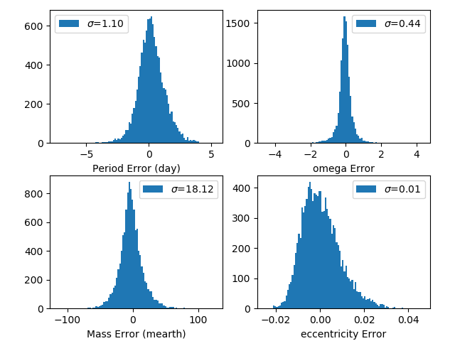
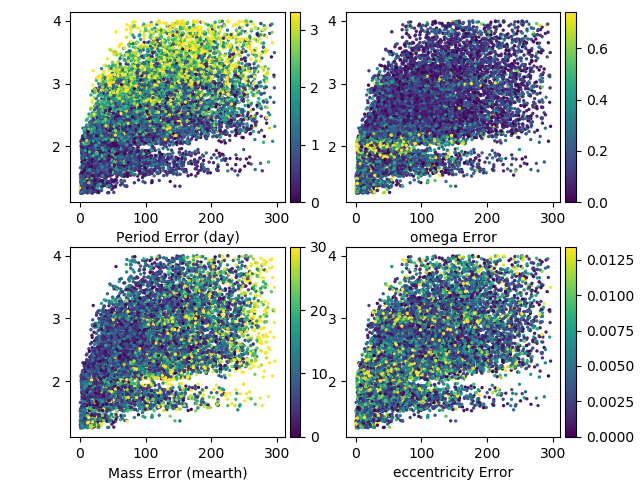
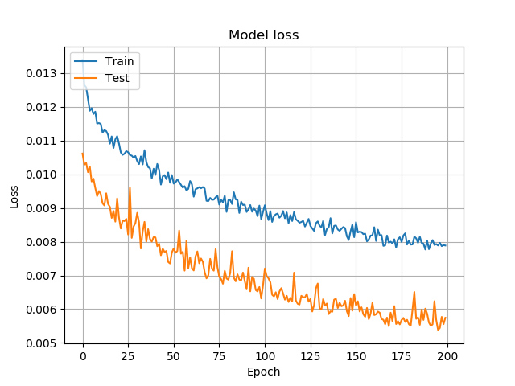
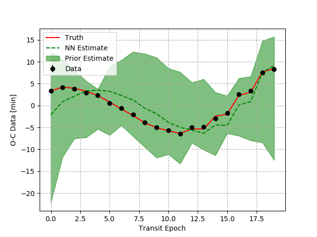

# Estimating parameters with artificial intelligence 


## Training data
Creating a random simulation is as easy as:
```python
from nbody.simulation import randomize, generate, analyze

objects = randomize()

sim_data = generate(
    objects, 
    Ndays=objects[1]['P']*31, 
    Noutputs=round(objects[1]['P']*31*24) # dt = 1 hr
) 

ttv_data = analyze(sim_data)
```
The priors for generating random simulations can be found on [line 42 of `nbody/simulation.py`](). To generate multiple simulations see: `generate_simulations.py`

```
usage: generate_simulations.py [-h] [-f FILE] [-s SAMPLES] [-o OMEGAS]
                               [-p PERIODS]

optional arguments:
  -h, --help            show this help message and exit
  -f FILE, --file FILE  Name of pickle file to save simulations to
  -s SAMPLES, --samples SAMPLES
                        Number of simulations
  -o OMEGAS, --omegas OMEGAS
                        Number of periastron arguments per simulation
  -p PERIODS, --periods PERIODS
                        Number of planet 1 orbital periods to integrate the
                        simulation for
```
To create a data set suitable for tensorflow see `generate_dataset.py` after creating multiple simulations
```
usage: generate_dataset.py [-h] [-i INPUT] [-o OUTPUT]

optional arguments:
  -h, --help            show this help message and exit
  -i INPUT, --input INPUT
                        Input pickle file of simulations
  -o OUTPUT, --output OUTPUT
                        Pickle file to write X,y data to
```

The distribution of 10000 random simulations will look like this: 

This particular distribution of training data uses simulations with TTV amplitudes less than 10 minutes and greater than 30 seconds. The colors are mapped to the amplitude of TTV with red colors being 10 minutes. A corner plot with colors mapped to TTV amplitudes can be created in [`corner_plot.py`]()

## Creating a machine learning model 
The data we typically know from observations are: M*, P1, M1, O-C Data. Therefore, we want to predict M2, P2, e2, omega2 from the known parameters and the observational data. There are functions in [`nbody/ai.py`]() to quickly create fully connected and convolutional neural networks. 

```python
import tensorflow as tf 
from nbody.ai import build_encoder

encoder = build_encoder(
    input_dims=[3,30], 
    layer_sizes=[ [8,8], [32,32] ],
    combined_layers = [128,64,32], 
    dropout=0.25,  
    output_dim=4
)

encoder.summary()

encoder.compile(
    optimizer=tf.keras.optimizers.Adam(learning_rate=1e-3), 
    loss=tf.keras.losses.MeanSquaredError(),
    metrics=['accuracy']
)
```

The encoder has two inputs: the 30 O-C data points and 3 parameters. An encoder/regression neural network will look something like this: 



Training different neural networks can be done from the command line. For a full fledged example see: [`encoder_single.py`]()

```
usage: encoder_single.py [-h] [-w WEIGHTS] [-e EPOCHS] [-tr TRAIN] [-te TEST]

optional arguments:
  -h, --help            show this help message and exit
  -w WEIGHTS, --weights WEIGHTS
                        Load h5 model trained weights
  -e EPOCHS, --epochs EPOCHS
                        Number of training epochs
  -tr TRAIN, --train TRAIN
                        Pickle file of training samples
  -te TEST, --test TEST
                        Pickle file of test samples
```

## Training and Validation 
Uncertainties in the FC network after 250 training epochs


Uncertainties in each portion of the parameter space,x-axis: earth mass, y-axis: period ratio (P2/P1)





Finally we can estimate the prior and planetary parameters using the trained neural network. The prior is used to expedite a parameter retrieval using [nested sampling]().



```python 
usage: estimate_prior.py [-h] [-tr TRAIN] [-i INPUT] [-ms MSTAR] [-tm TMID]
                         [-m1 MASS1] [-p1 PERIOD1]

optional arguments:
  -h, --help            show this help message and exit
  -tr TRAIN, --train TRAIN
                        Pickle file of training samples
  -i INPUT, --input INPUT
                        Input file with 3 columns of data (x,y,yerr)
  -ms MSTAR, --mstar MSTAR
                        stellar mass
  -tm TMID, --tmid TMID
                        mid transit prior
  -m1 MASS1, --mass1 MASS1
                        planet 1 mass (earth)
  -p1 PERIOD1, --period1 PERIOD1
                        planet 1 period (earth)
```

## Example commands from start to finish
```
python generate_simulations.py -f Xy30_10.pkl -o 10 -s 10000
python generate_simulations.py -f Xy30_6.pkl -o 6 -s 10000
python encoder_single.py --train Xy30_10.pkl --test Xy30_6.pkl --epochs 100
python estimate_prior.py --train Xy30_10.pkl -i sim_data.txt -ms 1 -m1 32 -p1 3.288
```

## Things to improve
- CNN encoder?
- hyper parameter optimization
- Create a decoder network/VAE
- Fourier analysis of O-C signal 
- Predict unstable orbits